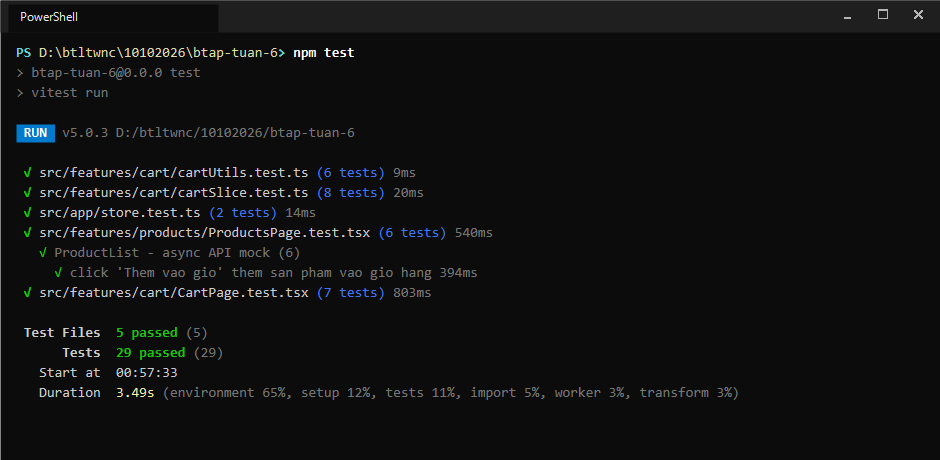
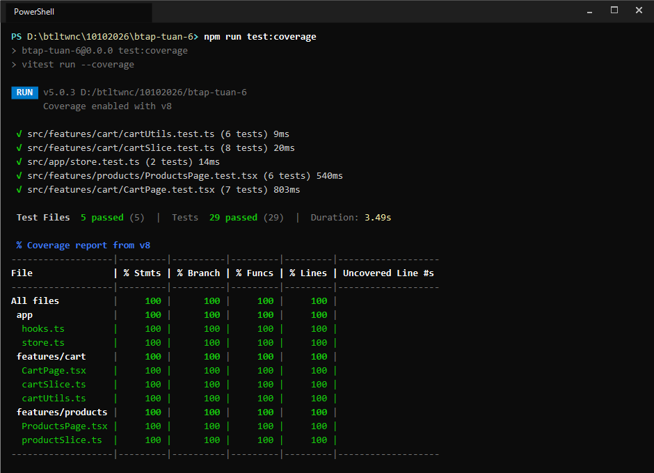

# BÁO CÁO BÀI TẬP TUẦN 6: KIỂM THỬ FRONTEND VỚI TYPESCRIPT

## Module kiểm thử: Giỏ hàng & Sản phẩm (Cart & Products)

---

## 1. Mục tiêu và Yêu cầu bài tập

Báo cáo thực hành môn **Lập trình Web Nâng cao – Tuần 6**. Đề tài yêu cầu xây dựng bộ kiểm thử tự động (Unit test và Integration test) cho module Giỏ hàng / Sản phẩm đã phát triển ở Buổi 3–4, sử dụng TypeScript, Redux Toolkit, Vitest và React Testing Library.

### Bảng đối chiếu yêu cầu đề bài:

| Yêu cầu đề bài | Kết quả thực hiện | Đánh giá |
|----------------|-------------------|:--------:|
| Tối thiểu 10 test cases | Đã xây dựng **29 test cases** | Đạt (29/10) |
| Đủ Unit test (hàm, reducer, hook) | 16 Unit test (`cartUtils`, `cartSlice`, `store`) | Đạt |
| Đủ Integration test (component + RTL) | 13 Integration & Async test (`CartPage`, `ProductsPage`) | Đạt |
| Có ít nhất 1 test bất đồng bộ mock API | 3 async test cases kiểm tra `loading`, `success`, `error` | Đạt |
| Độ phủ `jest/vitest --coverage` $\ge 70\%$ | Độ phủ thực tế đạt **100% Statements, 100% Branches, 100% Lines** | Đạt (100% $\ge$ 70%) |

---

## 2. Cấu trúc thư mục kiểm thử

```
btap-tuan-6/
├── docs/
│   └── images/
│       ├── test-run-result.png           # Ảnh chụp terminal chạy toàn bộ test suites
│       └── coverage-summary-result.png   # Ảnh chụp terminal bảng báo cáo coverage v8
├── src/
│   ├── app/
│   │   ├── hooks.ts                      # Typed hooks useAppDispatch, useAppSelector
│   │   ├── store.ts                      # Cấu hình Redux store
│   │   └── store.test.ts                 # Unit test kiểm tra khởi tạo store và dispatch
│   ├── features/
│   │   ├── cart/
│   │   │   ├── cartType.ts               # Interface CartItem, CartState
│   │   │   ├── cartSlice.ts              # Redux slice: addItem, removeItem, updateQuantity, clearCart
│   │   │   ├── cartUtils.ts              # Hàm thuần: calculateTotal, calculateTotalQuantity
│   │   │   ├── CartPage.tsx              # Component hiển thị giỏ hàng
│   │   │   ├── cartUtils.test.ts         # Unit test hàm tính toán (6 TCs)
│   │   │   ├── cartSlice.test.ts         # Unit test reducer giỏ hàng (8 TCs)
│   │   │   └── CartPage.test.tsx         # Integration test giỏ hàng (7 TCs)
│   │   └── products/
│   │       ├── productType.ts            # Interface Product, ProductState
│   │       ├── productSlice.ts           # Redux slice với createAsyncThunk fetchProducts
│   │       ├── ProductsPage.tsx          # Component danh sách sản phẩm
│   │       └── ProductsPage.test.tsx     # Integration & Async mock test (6 TCs)
│   ├── test/
│   │   ├── setup.ts                      # Cấu hình matcher @testing-library/jest-dom/vitest
│   │   └── renderWithProviders.tsx       # Helper render component với Redux Provider độc lập
│   ├── vite-env.d.ts                     # Type definitions cho Vite và Jest-DOM matchers
│   ├── App.tsx                           # Giao diện tổng hợp
│   └── main.tsx                          # Entrypoint ứng dụng
├── vite.config.ts                        # Cấu hình Vitest, môi trường jsdom và coverage text
└── README.md                             # Báo cáo kết quả kiểm thử
```

---

## 3. Danh mục 29 Test Cases

### 3.1. Unit Test hàm tính toán (`cartUtils.test.ts` - 6 TCs)
- **TC-01:** `calculateTotal` – Giỏ hàng rỗng trả về `0`.
- **TC-02:** `calculateTotal` – 1 sản phẩm số lượng 1 tính đúng đơn giá.
- **TC-03:** `calculateTotal` – 1 sản phẩm số lượng $>1$ nhân đúng giá với số lượng.
- **TC-04:** `calculateTotal` – Nhiều sản phẩm tính đúng tổng tiền tích lũy.
- **TC-05:** `calculateTotalQuantity` – Giỏ hàng rỗng trả về `0`.
- **TC-06:** `calculateTotalQuantity` – Nhiều sản phẩm tính đúng tổng số lượng.

### 3.2. Unit Test Redux Reducer Giỏ hàng (`cartSlice.test.ts` - 8 TCs)
- **TC-07:** Khởi tạo state giỏ hàng rỗng `items: []`.
- **TC-08:** `addItem` – Thêm sản phẩm mới với số lượng mặc định là 1.
- **TC-09:** `addItem` – Thêm sản phẩm đã tồn tại thì tăng số lượng thay vì tạo dòng mới.
- **TC-10:** `removeItem` – Xóa sản phẩm khỏi giỏ theo id.
- **TC-11:** `removeItem` – Xóa với id không tồn tại không làm thay đổi state.
- **TC-12:** `updateQuantity` – Cập nhật số lượng mới cho sản phẩm.
- **TC-13:** `updateQuantity` – Cập nhật id không tồn tại không làm thay đổi state.
- **TC-14:** `clearCart` – Xóa sạch toàn bộ sản phẩm trong giỏ hàng.

### 3.3. Unit Test Redux Store (`store.test.ts` - 2 TCs)
- **TC-15:** Khởi tạo store với state mặc định cho cả hai slice `cart` và `products`.
- **TC-16:** Thực hiện dispatch action và kiểm tra state cập nhật trong root store.

### 3.4. Integration Test Component Giỏ hàng (`CartPage.test.tsx` - 7 TCs)
- **TC-17:** Hiển thị thông báo *"Giỏ hàng đang trống."* khi state rỗng.
- **TC-18:** Render đầy đủ danh sách tên, giá và số lượng từng mặt hàng.
- **TC-19:** Hiển thị chính xác tổng số lượng sản phẩm và tổng tiền thanh toán.
- **TC-20:** Nút `-` bị vô hiệu hóa (`disabled`) khi số lượng sản phẩm bằng 1.
- **TC-21:** Nhấn nút `+` tăng số lượng sản phẩm và cập nhật tổng tiền.
- **TC-22:** Nhấn nút `-` giảm số lượng sản phẩm khi số lượng đang $>1$.
- **TC-23:** Nhấn nút `Xóa` loại bỏ sản phẩm khỏi giỏ hàng.

### 3.5. Async & Integration Test Sản phẩm (`ProductsPage.test.tsx` - 6 TCs)
- **TC-24:** [Async] Hiển thị thông báo *"Đang tải sản phẩm..."* khi API đang chờ xử lý (`pending`).
- **TC-25:** [Async] Hiển thị danh sách sản phẩm khi API trả về thành công (`fulfilled`).
- **TC-26:** [Async] Hiển thị thông báo lỗi khi API thất bại (`rejected`).
- **TC-27:** Render danh sách sản phẩm khi store đã có dữ liệu khởi tạo trước (`preloadedState`).
- **TC-28:** Click *"Thêm vào giỏ"* dispatch action thêm sản phẩm vào Redux cart store.
- **TC-29:** Xử lý `fetchProducts.rejected` với thông báo lỗi mặc định khi không có payload message.

---

## 4. Hướng dẫn chạy kiểm thử & Kết quả thực tế

### 4.1. Lệnh chạy toàn bộ kiểm thử

```bash
npm test
```

> **Ảnh chụp kết quả chạy `npm test` trong Terminal (5 test suites, 29 test cases Passed):**



---

### 4.2. Lệnh chạy kiểm tra độ phủ Code Coverage

```bash
npm run test:coverage
```

> **Ảnh chụp kết quả chạy `npm run test:coverage` trong Terminal (Độ phủ đạt 100%):**



---

## 5. Phương pháp kỹ thuật áp dụng

1. **Mô hình AAA (Arrange – Act – Assert):**
   Mỗi bài test phân tách rõ ràng 3 bước: chuẩn bị dữ liệu mẫu và state $\rightarrow$ thực thi hành động tương tác $\rightarrow$ xác minh kết quả đầu ra.
2. **Cô lập môi trường kiểm thử (Test Isolation):**
   Sử dụng hàm helper `renderWithProviders` khởi tạo store Redux mới cho từng test case, đảm bảo không lưu vết state giữa các bài kiểm tra.
3. **Mock API bất đồng bộ:**
   Sử dụng `vi.spyOn(globalThis, "fetch")` để giả lập các tình huống phản hồi từ máy chủ:
   - `Promise` chưa giải quyết để kiểm tra trạng thái loading.
   - `mockResolvedValueOnce` với mã HTTP 200 để kiểm tra hiển thị dữ liệu thành công.
   - `mockResolvedValueOnce` với mã HTTP 500 để kiểm tra xử lý ngoại lệ.
4. **Tương tác sự kiện:**
   Sử dụng `@testing-library/user-event` để mô phỏng chính xác thao tác click của người dùng thay vì gọi hàm kích hoạt nhân tạo.

---

## 6. Báo cáo độ phủ Code Coverage

### Bảng số liệu chi tiết theo từng tệp:

| File | % Stmts | % Branch | % Funcs | % Lines | Trạng thái (Yêu cầu $\ge 70\%$) |
|:-----|:-------:|:--------:|:-------:|:-------:|:-------------------------------:|
| **All files** | **100** | **100** | **100** | **100** | **ĐẠT (Vượt chỉ tiêu)** |
| `src/app/hooks.ts` | 100 | 100 | 100 | 100 | Đạt |
| `src/app/store.ts` | 100 | 100 | 100 | 100 | Đạt |
| `src/features/cart/CartPage.tsx` | 100 | 100 | 100 | 100 | Đạt |
| `src/features/cart/cartSlice.ts` | 100 | 100 | 100 | 100 | Đạt |
| `src/features/cart/cartUtils.ts` | 100 | 100 | 100 | 100 | Đạt |
| `src/features/products/ProductsPage.tsx` | 100 | 100 | 100 | 100 | Đạt |
| `src/features/products/productSlice.ts` | 100 | 100 | 100 | 100 | Đạt |

> **Nhận xét kết quả:**
> - Toàn bộ các dòng lệnh, nhánh điều kiện và hàm trong 2 module `cart` và `products` đều được thực thi qua bộ test, đạt mức bao phủ 100%.
> - Báo cáo không có dòng lệnh chưa kiểm thử (`Uncovered Line #s` trống), không xuất hiện cảnh báo đỏ trong terminal.

---

### Ảnh báo cáo Coverage chi tiết:


